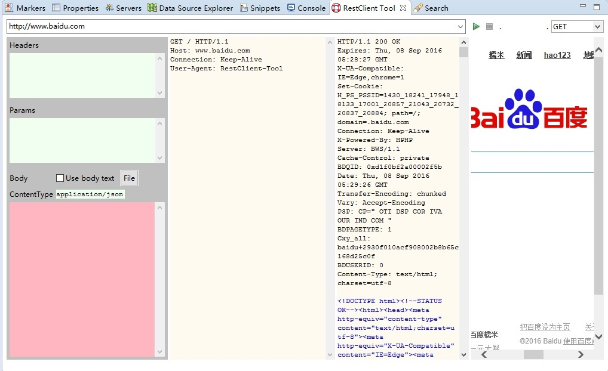
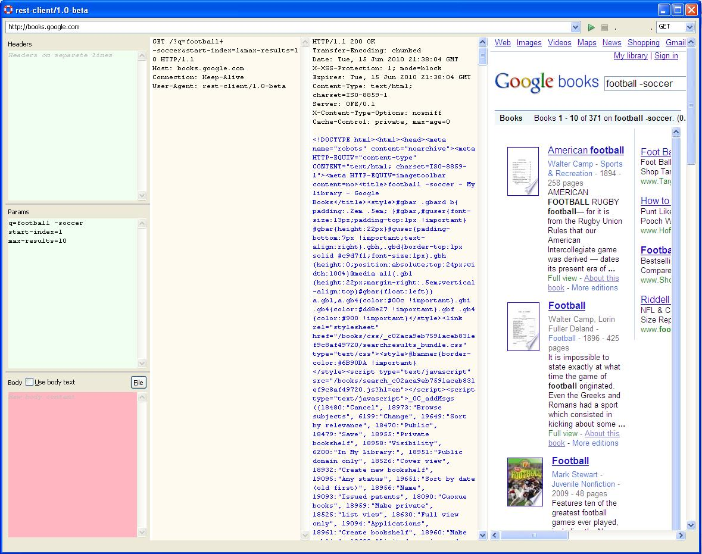
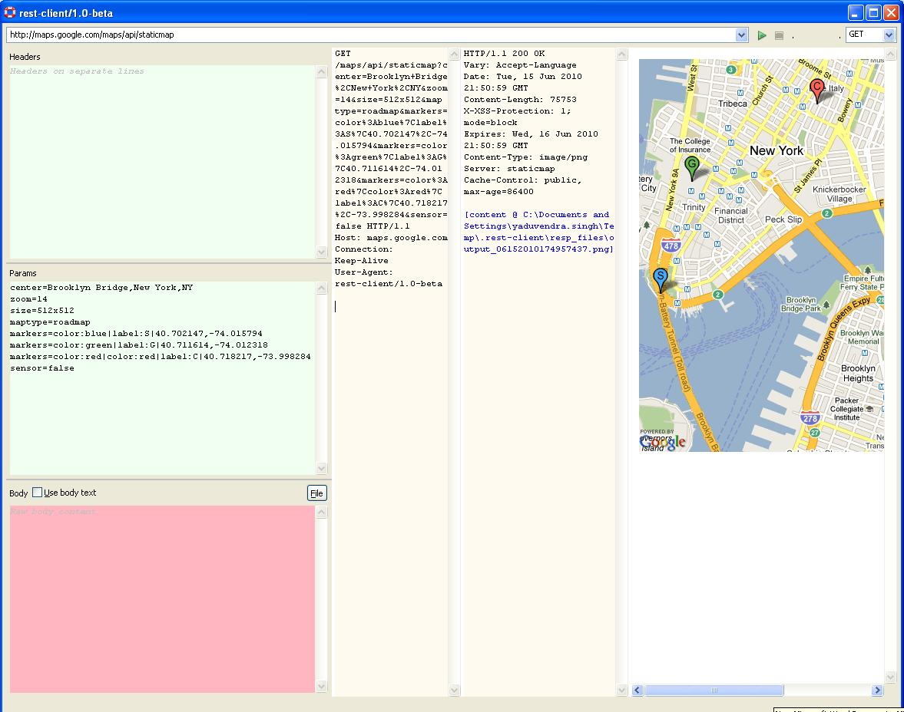

## REST Client

<!--

-->

Sources are migrated from [SVN](http://svn.codespot.com/a/eclipselabs.org/restclient-tool/trunk/) to [GitHub](https://github.com/Nodeclipse/restclient-tool/).

Old home page <http://code.google.com/a/eclipselabs.org/p/restclient-tool/>

New home page <http://www.nodeclipse.org/restclient-tool> 

<!--
New update site <http://www.nodeclipse.org/updates/restclient-tool/> (1.1.x not yet released)

Latest README <http://www.nodeclipse.org/restclient-tool/README>
-->

`standalone` project is now not in red, but build is to be ant, not Eclipse. 

### Build

Check original [docs\build_process.txt](docs\build_process.txt).

1. Update `app.version` in [standalone/build.properties](standalone/build.properties)
2. from `standalone` folder run `ant build-core-jar`

### TODO

look into [standalone/src/code/google/restclient/ui/MainWindow.java](standalone/src/code/google/restclient/ui/MainWindow.java)

